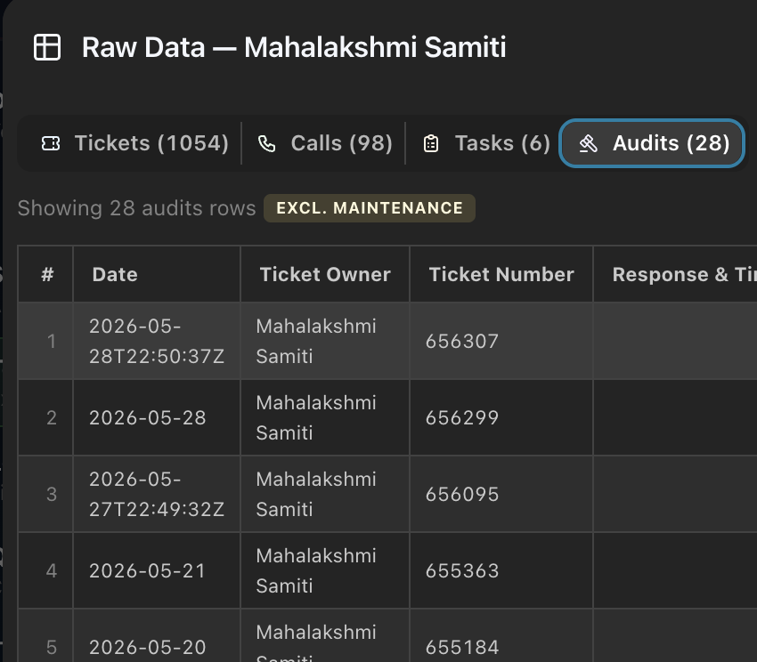

# Team Availability Widget — Management Overview

**Application:** NOC Dashboard  
**Audience:** Leadership / Management  
**Purpose:** Provide a high-level view of how the Team Availability Widget improves staffing visibility, operational control, and accountability.

---

## 1) Executive Summary

The **Team Availability Widget** is a real-time workforce operations panel that centralizes:

- Queue readiness (who is in-shift and in-queue)
- Break / meeting status visibility
- Punch in / punch out attendance communication
- Manager controls for reminders and escalation noise reduction

It replaces fragmented tracking methods (manual check-ins, spreadsheets, ad-hoc chat follow-ups) with a single, live operational view.

---

## 2) What It Solves

Traditional team coordination often relies on delayed updates, manual pings, and inconsistent attendance records.

This widget addresses those gaps by providing:

- **Immediate queue coverage visibility**
- **Standardized status updates** across members
- **Automated punch communication to Slack**
- **Backend event logging** for traceability and audits
- **Manager-level controls** for planned meeting windows

---

## 3) Key Capabilities (High Level)

### A. Real-time Availability Monitoring
- In-shift vs. in-queue numbers
- Queue-specific coverage snapshot
- Fast identification of members out of queue

### B. Status and Break Context
- Unified break/meeting status controls
- Team-level impact awareness for manager decisions

### C. Punch In / Punch Out Workflow
- Compact in-widget controls
- Prompt-based message entry on each action
- Message posted to Slack under impersonated sender
- Event persisted with timestamp and delivery metadata

### D. Reminder Governance
- Manager-only ability to pause reminders during scheduled meetings
- Reduces false-positive escalations and notification fatigue

---

## 4) Benefits for Team Members

- **Fewer manual updates:** One place for availability actions
- **Faster communication:** Punch messages sent instantly to team channel
- **Lower context switching:** No need to jump between tools
- **Clear accountability:** Actions are timestamped and consistently captured

---

## 5) Benefits for Management

- **Operational clarity in real time:** Better awareness of active staffing
- **Faster intervention:** Detect and resolve queue coverage gaps earlier
- **Improved governance:** Attendance and reminder events are auditable
- **Lower supervisory overhead:** Less manual follow-up and status polling
- **Higher process consistency:** Standardized actions across the team

---

## 6) Comparison vs Traditional Approach

| Area | Traditional Method | Team Availability Widget |
|---|---|---|
| Queue visibility | Periodic/manual | Live and continuous |
| Break/meeting context | Informal and inconsistent | Structured statuses with shared visibility |
| Attendance signaling | Chat-only, inconsistent | Structured punch actions + optional Slack post |
| Audit trail | Partial / fragmented | Centralized backend event logging |
| Manager follow-up | High manual effort | System-assisted visibility and controls |
| Alert quality | Noisy during meetings | Pause controls reduce unnecessary escalations |

---

## 7) Business Value / Expected Outcomes

- Higher queue discipline and staffing reliability
- Faster response to availability changes
- Reduced operational lag from manual coordination
- Better managerial confidence in real-time staffing decisions
- More reliable historical data for reviews and planning

---

## 8) Product Snapshot

---

## 9) Recommendation

Continue rollout as the primary team-operations surface for daily queue readiness and attendance signaling.  
Use backend logs from punch/reminder events for weekly operational reviews and coaching insights.
